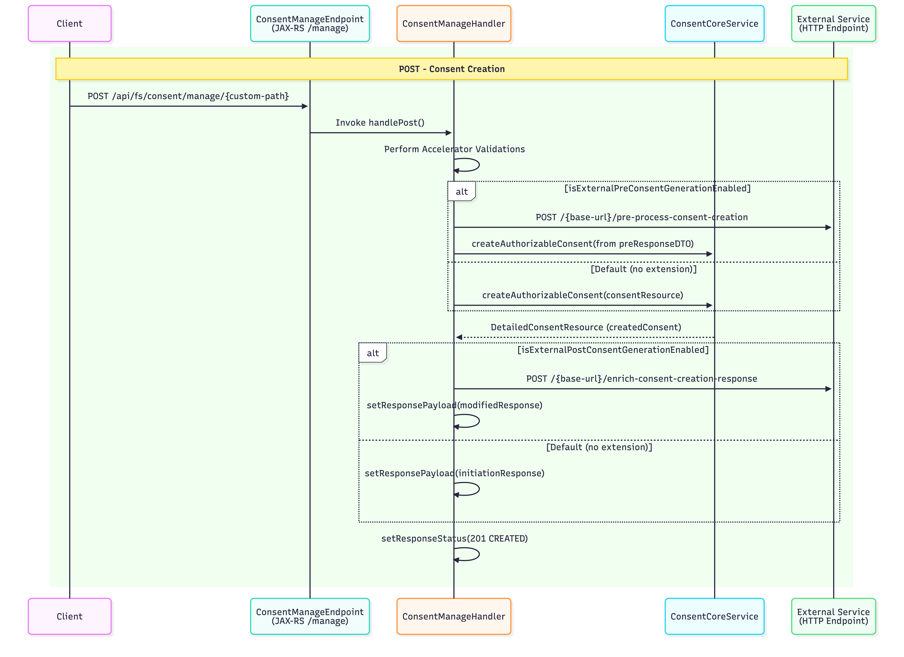
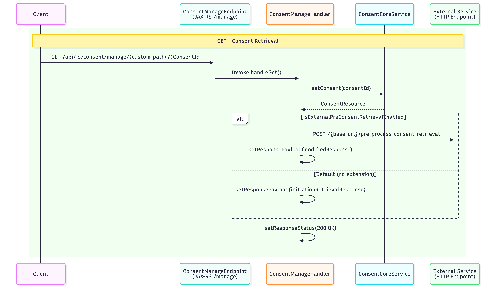
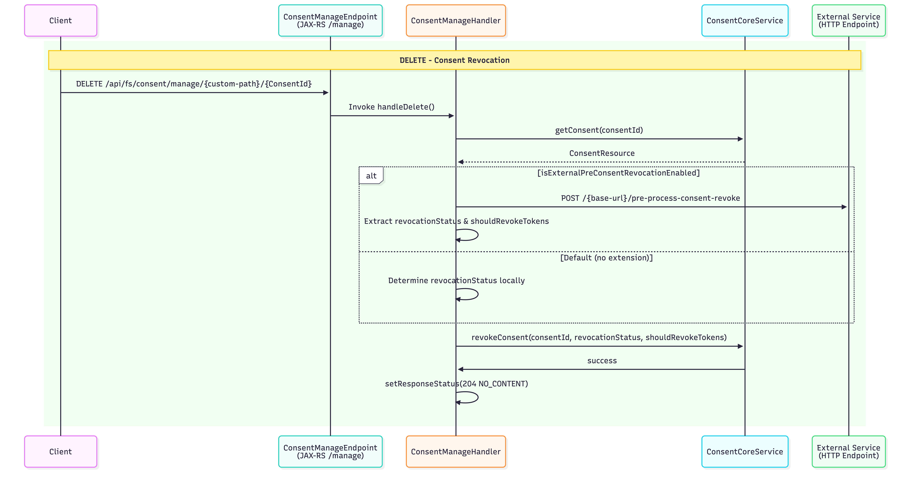
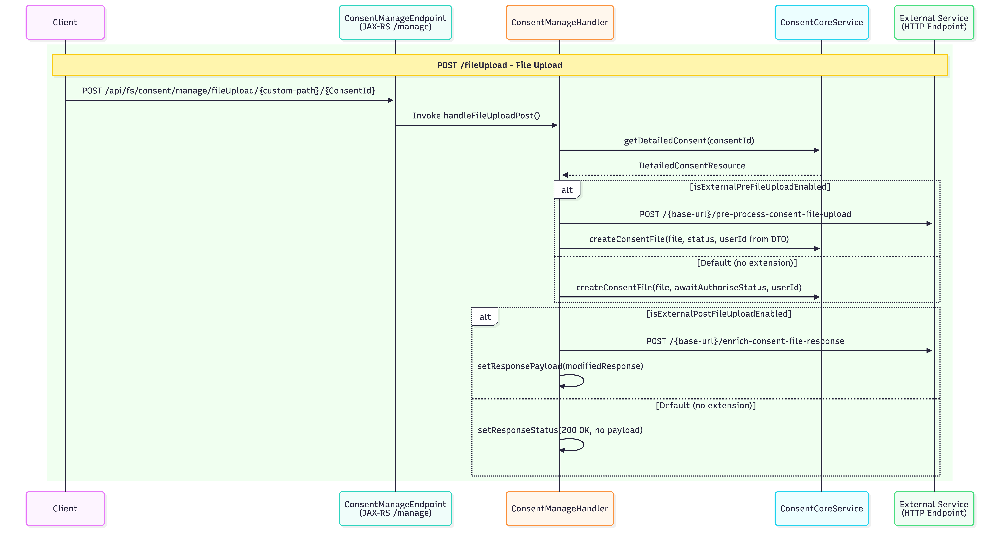
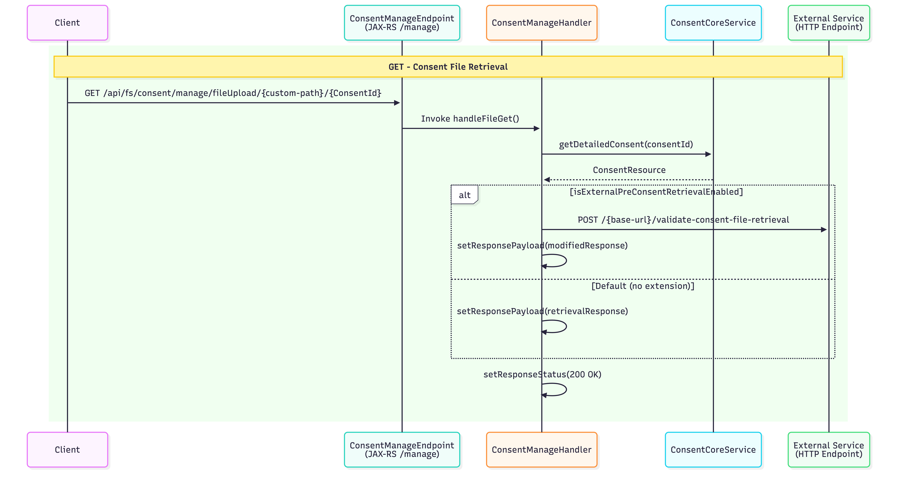

# Consent Manage Endpoint

The Consent Manage Endpoint (`/manage`) provides REST APIs to create, retrieve, update, and delete consent resources. These endpoints serve as backend services for the consent endpoints defined in the Open Banking specification.

WSO2 Open Banking Accelerator provides extension points to customize these components according to your requirements.

## Overview

This section demonstrates how to use the `/manage` endpoint for:

- Creating new consents
- Retrieving consent details
- Updating existing consents
- Revoking consents
- Uploading and retrieving files for file-based consents

??? info "Click here for Prerequisites"
    Before you try out the consent flow, ensure you have completed the following:
    
    - Configure API Resources, Users, and Roles
    - Assign roles to the user
    - Register an application for the API consumer
    - Replace `<AUTH_HEADER_VALUE>` with Base64 encoded `admin_username:admin_password` value  
      Example: `Base64(admin_username:admin_password)`
    - Transport certificates are available [here](../../assets/attachments/transport-certs)
                
## Consent Manage Creation

Create a request to obtain the customer's consent to access their bank accounts and related information.



**Sample Request:**

```bash
curl -X POST \
  'https://<IS_HOSTNAME>:9446/api/fs/consent/manage/account-access-consents' \
  -H 'Authorization: Basic <AUTH_HEADER_VALUE>' \
  -H 'x-wso2-client-id: <CLIENT_ID>' \
  -H 'Content-Type: application/json' \
  -H 'x-fapi-interaction-id: <INTERACTION_ID>' \
  --cert <TRANSPORT_PUBLIC_KEY_FILE_PATH> --key <TRANSPORT_PRIVATE_KEY_FILE_PATH> \
  --data '{
    "Data": {
      "TransactionToDateTime": "2026-03-19T13:46:07.270659+05:30",
      "ExpirationDateTime": "2026-03-21T13:46:07.269894+05:30",
      "Permissions": [
        "ReadAccountsBasic",
        "ReadAccountsDetail",
        "ReadBalances",
        "ReadTransactionsDetail"
      ],
      "TransactionFromDateTime": "2026-03-16T13:46:07.270580+05:30"
    },
    "Risk": {}
  }'
```

**Sample Response:**

The response contains a Consent ID:

```json
{
  "Data": {
    "StatusUpdateDateTime": "2026-03-16T13:46:08+05:30",
    "Status": "AwaitingAuthorisation",
    "CreationDateTime": "2026-03-16T13:46:08+05:30",
    "TransactionToDateTime": "2026-03-19T13:46:07.270659+05:30",
    "ExpirationDateTime": "2026-03-21T13:46:07.269894+05:30",
    "Permissions": [
      "ReadAccountsBasic",
      "ReadAccountsDetail",
      "ReadBalances",
      "ReadTransactionsDetail"
    ],
    "ConsentId": "328524c0-b4a3-457e-a145-e79d92c4654e",
    "TransactionFromDateTime": "2026-03-16T13:46:07.270580+05:30"
  },
  "Risk": {}
}
```
 
## Consent Manage Retrieve

Use the Consent Retrieval endpoint to retrieve a consent resource and check its status.



**Sample Request:**

```bash
curl -X GET \
  https://<IS_HOSTNAME>:9446/api/fs/consent/manage/account-access-consents/<CONSENT_ID> \
  -H 'Authorization: Basic <AUTH_HEADER_VALUE>' \
  -H 'x-wso2-client-id: <CLIENT_ID>' \
  -H 'x-fapi-interaction-id: <INTERACTION_ID>' \
  -H 'Accept: application/json' \
  -H 'charset: UTF-8' \
  -H 'Content-Type: application/json; charset=UTF-8' \
  --cert <PUBLIC_KEY_FILE_PATH> --key <PRIVATE_KEY_FILE_PATH>
```

**Sample Response:**

```json
{
  "Data": {
    "StatusUpdateDateTime": "2026-03-16T13:46:08+05:30",
    "Status": "AwaitingAuthorisation",
    "CreationDateTime": "2026-03-16T13:46:08+05:30",
    "TransactionToDateTime": "2026-03-19T13:46:07.270659+05:30",
    "ExpirationDateTime": "2026-03-21T13:46:07.269894+05:30",
    "Permissions": [
      "ReadAccountsBasic",
      "ReadAccountsDetail",
      "ReadBalances",
      "ReadTransactionsDetail"
    ],
    "ConsentId": "328524c0-b4a3-457e-a145-e79d92c4654e",
    "TransactionFromDateTime": "2026-03-16T13:46:07.270580+05:30"
  },
  "Risk": {}
}
```

## Consent Manage Internal Detail Retrieve

WSO2 Accelerator provides an internal consent-retrieval endpoint to retrieve details of a consent resource and check its authorizations. This endpoint can be invoked only by banks using the `x-wso2-internal-request` header.

**Sample Request:**

```bash
curl -X GET \
  https://<IS_HOSTNAME>:9446/api/fs/consent/manage/account-access-consents/<CONSENT_ID> \
  -H 'Authorization: Basic <AUTH_HEADER_VALUE>' \
  -H 'x-wso2-internal-request: true' \
  -H 'x-wso2-client-id: <CLIENT_ID>' \
  -H 'x-fapi-interaction-id: <INTERACTION_ID>' \
  -H 'Accept: application/json' \
  -H 'charset: UTF-8' \
  -H 'Content-Type: application/json; charset=UTF-8' \
  --cert <PUBLIC_KEY_FILE_PATH> --key <PRIVATE_KEY_FILE_PATH>
```

**Sample Response:**

```json
{
  "validityPeriod": 1774080967,
  "consentAttributes": {},
  "updatedTime": 1773648968,
  "consentID": "328524c0-b4a3-457e-a145-e79d92c4654e",
  "clientID": "7bw8O8_7_E7s2Y6reXupdwXqGm4a",
  "consentType": "accounts",
  "createdTime": 1773648968,
  "recurringIndicator": false,
  "receipt": "{\"Data\": {\"Permissions\": [\"ReadAccountsBasic\", \"ReadAccountsDetail\", \"ReadBalances\", \"ReadTransactionsDetail\"], \"ExpirationDateTime\": \"2026-03-21T13:46:07.269894+05:30\", \"TransactionToDateTime\": \"2026-03-19T13:46:07.270659+05:30\", \"TransactionFromDateTime\": \"2026-03-16T13:46:07.270580+05:30\"}, \"Risk\": {}}",
  "authorizationResources": [
    {
      "authorizationID": "7b77e19b-e588-49b9-a4fb-937c66f589ce",
      "authorizationType": "authorisation",
      "resources": [],
      "authorizationStatus": "Created"
    }
  ],
  "consentFrequency": 0,
  "status": "AwaitingAuthorisation"
}
```

## Consent Update

The bank can update customer consent using this internal endpoint. This endpoint can only be invoked by banks with the `x-wso2-internal-request` header.

**Sample Request:**

```bash
curl -X PUT \
  https://<IS_HOSTNAME>:9446/api/fs/consent/manage/account-access-consents/<CONSENT_ID> \
  -H 'Authorization: Basic <AUTH_HEADER_VALUE>' \
  -H 'x-wso2-client-id: <CLIENT_ID>' \
  -H 'x-wso2-internal-request: true' \
  -H 'x-fapi-interaction-id: <INTERACTION_ID>' \
  -H 'Content-Type: application/json' \
  --cert <TRANSPORT_PUBLIC_KEY_FILE_PATH> --key <TRANSPORT_PRIVATE_KEY_FILE_PATH> \
  --data '{
    "consentID": "328524c0-b4a3-457e-a145-e79d92c4654e",
    "status": "Authorised",
    "validityPeriod": 1774080967,
    "recurringIndicator": true,
    "consentFrequency": 0,
    "receipt": "{\"Data\": {\"Permissions\": [\"ReadAccountsBasic\",\"ReadAccountsDetail\",\"ReadBalances\"],\"ExpirationDateTime\": \"2026-03-17T15:43:35.946770+05:30\",\"TransactionFromDateTime\": \"2026-03-12T15:43:35.947399+05:30\",\"TransactionToDateTime\": \"2026-03-15T15:43:35.947514+05:30\"},\"Risk\": {}}",
    "consentAttributes": {
      "key1": "value1",
      "key2": "value2"
    },
    "authorizationResources": [
      {
        "userID": "admin@wso2.com",
        "authorizationType": "auth",
        "authorizationStatus": "Created",
        "resources": [
          {
            "accountID": "1962368",
            "permission": "account",
            "mappingStatus": "active"
          }
        ]
      }
    ]
  }'
```

**Sample Response:**

```json
{
  "validityPeriod": 1774080967,
  "consentAttributes": {
    "key1": "value1",
    "key2": "value2"
  },
  "updatedTime": 1773648968,
  "consentID": "328524c0-b4a3-457e-a145-e79d92c4654e",
  "clientID": "7bw8O8_7_E7s2Y6reXupdwXqGm4a",
  "consentType": "accounts",
  "createdTime": 1773648968,
  "recurringIndicator": true,
  "receipt": "{\"Data\": {\"Permissions\": [\"ReadAccountsBasic\", \"ReadAccountsDetail\", \"ReadBalances\"], \"ExpirationDateTime\": \"2026-03-17T15:43:35.946770+05:30\", \"TransactionToDateTime\": \"2026-03-15T15:43:35.947514+05:30\", \"TransactionFromDateTime\": \"2026-03-12T15:43:35.947399+05:30\"}, \"Risk\": {}}",
  "authorizationResources": [
    {
      "authorizationID": "f562ce1f-7afc-4b6f-ac9d-2c3b1b5633d3",
      "authorizationType": "auth",
      "resources": [
        {
          "mappingStatus": "active",
          "mappingID": "eeb76808-ce1c-4cdb-b161-b5b370c5827e",
          "accountID": "1962368",
          "permission": "account"
        }
      ],
      "authorizationStatus": "Created",
      "userID": "admin@wso2.com"
    }
  ],
  "consentFrequency": 0,
  "status": "Authorised"
}
```

### Partial Consent Updates

The consent update endpoint supports partial updates to existing consents.

#### Scenario 1: Update Consent Status

**Sample Request:**

```bash
curl -X PUT \
  https://<IS_HOSTNAME>:9446/api/fs/consent/manage/account-access-consents/<CONSENT_ID> \
  -H 'Authorization: Basic <AUTH_HEADER_VALUE>' \
  -H 'x-wso2-client-id: <CLIENT_ID>' \
  -H 'x-wso2-internal-request: true' \
  -H 'x-fapi-interaction-id: <INTERACTION_ID>' \
  -H 'Content-Type: application/json' \
  --cert <TRANSPORT_PUBLIC_KEY_FILE_PATH> --key <TRANSPORT_PRIVATE_KEY_FILE_PATH> \
  --data '{
    "consentID": "328524c0-b4a3-457e-a145-e79d92c4654e",
    "status": "Authorised"
  }'
```

**Sample Response:**

```json
{
  "validityPeriod": 1774080967,
  "consentAttributes": {
    "key1": "value1",
    "key2": "value2"
  },
  "updatedTime": 1773648968,
  "consentID": "328524c0-b4a3-457e-a145-e79d92c4654e",
  "clientID": "7bw8O8_7_E7s2Y6reXupdwXqGm4a",
  "consentType": "accounts",
  "createdTime": 1773648968,
  "recurringIndicator": true,
  "receipt": "{\"Data\": {\"Permissions\": [\"ReadAccountsBasic\", \"ReadAccountsDetail\", \"ReadBalances\"], \"ExpirationDateTime\": \"2026-03-17T15:43:35.946770+05:30\", \"TransactionToDateTime\": \"2026-03-15T15:43:35.947514+05:30\", \"TransactionFromDateTime\": \"2026-03-12T15:43:35.947399+05:30\"}, \"Risk\": {}}",
  "authorizationResources": [
    {
      "authorizationID": "f562ce1f-7afc-4b6f-ac9d-2c3b1b5633d3",
      "authorizationType": "auth",
      "resources": [
        {
          "mappingStatus": "active",
          "mappingID": "eeb76808-ce1c-4cdb-b161-b5b370c5827e",
          "accountID": "1962368",
          "permission": "account"
        }
      ],
      "authorizationStatus": "Created",
      "userID": "admin@wso2.com"
    }
  ],
  "consentFrequency": 0,
  "status": "Authorised"
}
```

#### Scenario 2: Update Consent Validity Period

**Sample Request:**

```bash
curl -X PUT \
  https://<IS_HOSTNAME>:9446/api/fs/consent/manage/account-access-consents/<CONSENT_ID> \
  -H 'Authorization: Basic <AUTH_HEADER_VALUE>' \
  -H 'x-wso2-client-id: <CLIENT_ID>' \
  -H 'x-wso2-internal-request: true' \
  -H 'x-fapi-interaction-id: <INTERACTION_ID>' \
  -H 'Content-Type: application/json' \
  --cert <TRANSPORT_PUBLIC_KEY_FILE_PATH> --key <TRANSPORT_PRIVATE_KEY_FILE_PATH> \
  --data '{
    "consentID": "328524c0-b4a3-457e-a145-e79d92c4654e",
    "validityPeriod": 1774080967
  }'
```

**Sample Response:**

```json
{
  "validityPeriod": 1774080967,
  "consentAttributes": {
    "key1": "value1",
    "key2": "value2"
  },
  "updatedTime": 1773648968,
  "consentID": "328524c0-b4a3-457e-a145-e79d92c4654e",
  "clientID": "7bw8O8_7_E7s2Y6reXupdwXqGm4a",
  "consentType": "accounts",
  "createdTime": 1773648968,
  "recurringIndicator": true,
  "receipt": "{\"Data\": {\"Permissions\": [\"ReadAccountsBasic\", \"ReadAccountsDetail\", \"ReadBalances\"], \"ExpirationDateTime\": \"2026-03-17T15:43:35.946770+05:30\", \"TransactionToDateTime\": \"2026-03-15T15:43:35.947514+05:30\", \"TransactionFromDateTime\": \"2026-03-12T15:43:35.947399+05:30\"}, \"Risk\": {}}",
  "authorizationResources": [
    {
      "authorizationID": "f562ce1f-7afc-4b6f-ac9d-2c3b1b5633d3",
      "authorizationType": "auth",
      "resources": [
        {
          "mappingStatus": "active",
          "mappingID": "eeb76808-ce1c-4cdb-b161-b5b370c5827e",
          "accountID": "1962368",
          "permission": "account"
        }
      ],
      "authorizationStatus": "Created",
      "userID": "admin@wso2.com"
    }
  ],
  "consentFrequency": 0,
  "status": "Authorised"
}
```

!!! note "Update Behavior"
    - The consent update request ignores unavailable or null values. For example, if the `frequency` field is not available or is null in the update payload, the existing value is not updated.
    - For `consentAttributes` and `authorizationResources`:
        - **If non-empty:** The system deletes existing data and stores the data from the update request payload.
        - **If empty:** The system deletes the existing data.
        - **If not available or null:** The existing value is not updated.

## Consent Revocation

If the customer revokes consent to data access, make a request to delete the consent resource.



**Sample Request:**

```bash
curl -X DELETE \
  https://<IS_HOSTNAME>:9446/api/fs/consent/manage/account-access-consents/<CONSENT_ID> \
  -H 'Authorization: Basic <AUTH_HEADER_VALUE>' \
  -H 'x-wso2-client-id: <CLIENT_ID>' \
  -H 'x-fapi-interaction-id: <INTERACTION_ID>' \
  -H 'Accept: application/json' \
  -H 'charset: UTF-8' \
  -H 'Content-Type: application/json; charset=UTF-8' \
  --cert <PUBLIC_KEY_FILE_PATH> --key <PRIVATE_KEY_FILE_PATH>
```

**Sample Response:**

If the deletion is successful, you will receive a `204 No Content` response.

## Consent File Upload

WSO2 Open Banking Accelerator supports uploading files for consent. Before uploading a file, banks must create a consent using the consent creation endpoint and then use this endpoint to upload files for that consent.



**Sample Request:**

```bash
curl --location 'https://localhost:9446/api/fs/consent/manage/fileUpload/file-payment-consents/<CONSENT_ID>' \
  -H 'x-wso2-client-id: <CLIENT_ID>' \
  -H 'Content-Type: application/xml' \
  -H 'Authorization: Basic <AUTH_HEADER_VALUE>' \
  -H 'x-fapi-interaction-id: <INTERACTION_ID>' \
  --cert <TRANSPORT_PUBLIC_KEY_FILE_PATH> --key <TRANSPORT_PRIVATE_KEY_FILE_PATH> \
  --data '<Document xmlns="urn:iso:std:iso:20022:tech:xsd:pain.001.001.08" xmlns:xsi="http://www.w3.org/2001/XMLSchema-instance">
  <CstmrCdtTrfInitn>
    <GrpHdr>
      <MsgId>ABC/120928/CCT001</MsgId>
      <CreDtTm>2012-09-28T14:07:00</CreDtTm>
      <NbOfTxs>2</NbOfTxs>
      <CtrlSum>70</CtrlSum>
      <InitgPty>
        <Nm>ABC Corporation</Nm>
        <PstlAdr>
          <StrtNm>Times Square</StrtNm>
          <BldgNb>7</BldgNb>
          <PstCd>NY 10036</PstCd>
          <TwnNm>New York</TwnNm>
          <Ctry>US</Ctry>
        </PstlAdr>
      </InitgPty>
    </GrpHdr>
    <PmtInf>
      <PmtInfId>ABC/086</PmtInfId>
      <PmtMtd>TRF</PmtMtd>
      <BtchBookg>false</BtchBookg>
      <ReqdExctnDt>
        <Dt>2026-10-01</Dt>
      </ReqdExctnDt>
      <PmtTpInf>
        <LclInstrm>UK.OBIE.BAC</LclInstrm>
      </PmtTpInf>
      <Dbtr>
        <Nm>ABC Corporation</Nm>
        <PstlAdr>
          <StrtNm>Times Square</StrtNm>
          <BldgNb>7</BldgNb>
          <PstCd>NY 10036</PstCd>
          <TwnNm>New York</TwnNm>
          <Ctry>US</Ctry>
        </PstlAdr>
      </Dbtr>
      <DbtrAcct>
        <Id>
          <Othr>
            <Id>30080012343456</Id>
          </Othr>
        </Id>
      </DbtrAcct>
      <DbtrAgt>
        <FinInstnId>
          <BICFI>BBBBUS33</BICFI>
        </FinInstnId>
      </DbtrAgt>
      <CdtTrfTxInf>
        <PmtId>
          <InstrId>ABC/120928/CCT001/01</InstrId>
          <EndToEndId>ABC/4562/2012-09-08</EndToEndId>
        </PmtId>
        <Amt>
          <InstdAmt Ccy="JPY">20</InstdAmt>
        </Amt>
        <ChrgBr>SHAR</ChrgBr>
        <CdtrAgt>
          <FinInstnId>
            <BICFI>AAAAGB2L</BICFI>
          </FinInstnId>
        </CdtrAgt>
        <Cdtr>
          <Nm>DEF Electronics</Nm>
          <PstlAdr>
            <AdrLine>Corn Exchange 5th Floor</AdrLine>
            <AdrLine>Mark Lane 55</AdrLine>
            <AdrLine>EC3R7NE London</AdrLine>
            <AdrLine>GB</AdrLine>
          </PstlAdr>
        </Cdtr>
        <CdtrAcct>
          <Id>
            <Othr>
              <Id>23683707994125</Id>
            </Othr>
          </Id>
        </CdtrAcct>
        <Purp>
          <Cd>GDDS</Cd>
        </Purp>
        <RmtInf>
          <Strd>
            <RfrdDocInf>
              <Tp>
                <CdOrPrtry>
                  <Cd>CINV</Cd>
                </CdOrPrtry>
              </Tp>
              <Nb>4562</Nb>
              <RltdDt>2012-09-08</RltdDt>
            </RfrdDocInf>
          </Strd>
        </RmtInf>
      </CdtTrfTxInf>
    </PmtInf>
  </CstmrCdtTrfInitn>
</Document>'
```

**Sample Response:**

If the upload is successful, you will receive a `200 OK` response.

## Consent File Retrieval

After a file is uploaded for consent, it can be retrieved using the file retrieval endpoint.



**Sample Request:**

```bash
curl --location 'https://localhost:9446/api/fs/consent/manage/fileUpload/file-payment-consents/<CONSENT_ID>' \
  -H 'x-wso2-client-id: <CLIENT_ID>' \
  -H 'Authorization: Basic <AUTH_HEADER_VALUE>' \
  -H 'x-fapi-interaction-id: <INTERACTION_ID>' \
  --cert <TRANSPORT_PUBLIC_KEY_FILE_PATH> --key <TRANSPORT_PRIVATE_KEY_FILE_PATH>
```

**Sample Response:**

The response returns the file content:

```xml
<Document xmlns="urn:iso:std:iso:20022:tech:xsd:pain.001.001.08" xmlns:xsi="http://www.w3.org/2001/XMLSchema-instance">
  <CstmrCdtTrfInitn>
    <GrpHdr>
      <MsgId>ABC/120928/CCT001</MsgId>
      <CreDtTm>2012-09-28T14:07:00</CreDtTm>
      <NbOfTxs>2</NbOfTxs>
      <CtrlSum>70</CtrlSum>
      <InitgPty>
        <Nm>ABC Corporation</Nm>
        <PstlAdr>
          <StrtNm>Times Square</StrtNm>
          <BldgNb>7</BldgNb>
          <PstCd>NY 10036</PstCd>
          <TwnNm>New York</TwnNm>
          <Ctry>US</Ctry>
        </PstlAdr>
      </InitgPty>
    </GrpHdr>
    <PmtInf>
      <PmtInfId>ABC/086</PmtInfId>
      <PmtMtd>TRF</PmtMtd>
      <BtchBookg>false</BtchBookg>
      <ReqdExctnDt>
        <Dt>2026-10-01</Dt>
      </ReqdExctnDt>
      <PmtTpInf>
        <LclInstrm>UK.OBIE.BAC</LclInstrm>
      </PmtTpInf>
      <Dbtr>
        <Nm>ABC Corporation</Nm>
        <PstlAdr>
          <StrtNm>Times Square</StrtNm>
          <BldgNb>7</BldgNb>
          <PstCd>NY 10036</PstCd>
          <TwnNm>New York</TwnNm>
          <Ctry>US</Ctry>
        </PstlAdr>
      </Dbtr>
      <DbtrAcct>
        <Id>
          <Othr>
            <Id>30080012343456</Id>
          </Othr>
        </Id>
      </DbtrAcct>
      <DbtrAgt>
        <FinInstnId>
          <BICFI>BBBBUS33</BICFI>
        </FinInstnId>
      </DbtrAgt>
      <CdtTrfTxInf>
        <PmtId>
          <InstrId>ABC/120928/CCT001/01</InstrId>
          <EndToEndId>ABC/4562/2012-09-08</EndToEndId>
        </PmtId>
        <Amt>
          <InstdAmt Ccy="JPY">20</InstdAmt>
        </Amt>
        <ChrgBr>SHAR</ChrgBr>
        <CdtrAgt>
          <FinInstnId>
            <BICFI>AAAAGB2L</BICFI>
          </FinInstnId>
        </CdtrAgt>
        <Cdtr>
          <Nm>DEF Electronics</Nm>
          <PstlAdr>
            <AdrLine>Corn Exchange 5th Floor</AdrLine>
            <AdrLine>Mark Lane 55</AdrLine>
            <AdrLine>EC3R7NE London</AdrLine>
            <AdrLine>GB</AdrLine>
          </PstlAdr>
        </Cdtr>
        <CdtrAcct>
          <Id>
            <Othr>
              <Id>23683707994125</Id>
            </Othr>
          </Id>
        </CdtrAcct>
        <Purp>
          <Cd>GDDS</Cd>
        </Purp>
        <RmtInf>
          <Strd>
            <RfrdDocInf>
              <Tp>
                <CdOrPrtry>
                  <Cd>CINV</Cd>
                </CdOrPrtry>
              </Tp>
              <Nb>4562</Nb>
              <RltdDt>2012-09-08</RltdDt>
            </RfrdDocInf>
          </Strd>
        </RmtInf>
      </CdtTrfTxInf>
    </PmtInf>
  </CstmrCdtTrfInitn>
</Document>
```

## Built-in Validations

The Consent Manage endpoints perform the following built-in validations before invoking OpenAPI extensions:

### Common Validations (All Endpoints)

All Consent Manage endpoints perform these basic validations:

- **`x-fapi-interaction-id` validation:** Checks if the request contains the header. If absent, a new UUID is generated and added to the response headers
- **Client ID presence validation:** Ensures the client ID is included in the request
- **Client ID validity check:** Verifies the client ID corresponds to a valid, existing client
- **Request path validation:** Confirms the request path is not null

### Endpoint-Specific Validations

| Endpoint | Additional Validations | OpenAPI Extension Invoked |
|---|---|---|
| **Create** | • Idempotency validation | `pre-process-consent-creation` |
| **Retrieve** | • Consent ID validation<br>• Consent-bound client ID validation | `pre-process-consent-retrieval` |
| **Revoke** | • Consent ID validation<br>• Consent-bound client ID validation | `pre-process-consent-revoke` |
| **File Upload** | • Consent ID validation<br>• Consent-bound client ID validation<br>• Idempotency validation | `pre-process-consent-file-upload` |
| **File Retrieval** | • Consent ID validation<br>• Consent-bound client ID validation | `pre-process-consent-file-retrieval` |

!!! note "Validation Details"
    - **Consent ID validation:** Extracts and verifies the consent ID exists in the system
    - **Consent-bound client ID validation:** Ensures the client ID matches the one associated with the consent
    - **Idempotency validation:** Prevents duplicate operations

## Customization

WSO2 Open Banking IAM Accelerator 4.0.0 onwards supports OpenAPI-based extensions for consent management customizations. For more information, see [Open API Based Extensions for Consent Manage Endpoints](../develop/consent-management-manage.md).