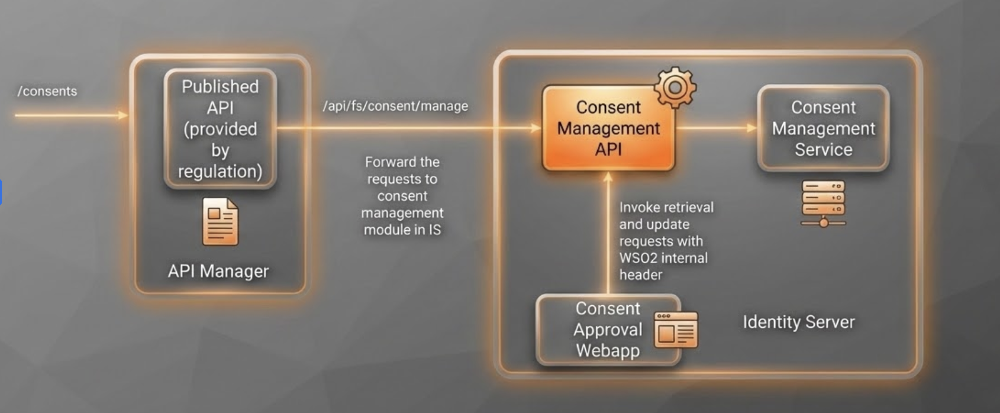

# Try Out a Basic Consent Flow

This document provides step-by-step instructions to try out the basic consent flow, including consent initiation, authorization, retrieval, and deletion.

 

## Prerequisites

Before you try out the consent flow, ensure you have completed the following:

- Configure API Resources, Users, and Roles
- Assign roles to the user
- Register an application for the API consumer

!!! note
    - Replace `<AUTH_HEADER_VALUE>` with Base64 encoded `admin_username:admin_password` value  
      Example: `Base64(admin_username:admin_password)`
    - Transport certificates are available [here](../../assets/attachments/transport-certs)
                
## Step 1: Consent Initiation

Create a request to obtain the customer's consent to access their bank accounts and related information.

**Sample Request:**

    ``` bash
    curl -X POST \
     'https://<IS_HOSTNAME>:9446/api/fs/consent/manage/account-access-consents' \
    -H 'Authorization: Basic <AUTH_HEADER_VALUE>' \
    -H 'x-wso2-client-id: <CLIENT_ID>' \
    -H 'x-fapi-interaction-id: <INTERACTION_ID>' \
    -H 'Content-Type: application/json' \
    --cert <TRANSPORT_PUBLIC_KEY_FILE_PATH> --key <TRANSPORT_PRIVATE_KEY_FILE_PATH> \
    --data '{
      "Data": {
          "TransactionToDateTime": "2026-03-19T13:46:07.270659+05:30",
          "ExpirationDateTime": "2026-03-21T13:46:07.269894+05:30",
          "Permissions": [
              "ReadAccountsBasic",
              "ReadAccountsDetail",
              "ReadBalances",
              "ReadTransactionsDetail"
          ],
          "TransactionFromDateTime": "2026-03-16T13:46:07.270580+05:30"
      },
      "Risk": {
          
      }
    }'
    ```
  
**Sample Response:**

The response contains a Consent ID:

    ``` json
    {
      "Data": {
          "StatusUpdateDateTime": "2026-03-16T13:46:08+05:30",
          "Status": "AwaitingAuthorisation",
          "CreationDateTime": "2026-03-16T13:46:08+05:30",
          "TransactionToDateTime": "2026-03-19T13:46:07.270659+05:30",
          "ExpirationDateTime": "2026-03-21T13:46:07.269894+05:30",
          "Permissions": [
              "ReadAccountsBasic",
              "ReadAccountsDetail",
              "ReadBalances",
              "ReadTransactionsDetail"
          ],
          "ConsentId": "328524c0-b4a3-457e-a145-e79d92c4654e",
          "TransactionFromDateTime": "2026-03-16T13:46:07.270580+05:30"
      },
      "Risk": {
          
      }
    }    
    ```

## Step 2: Authorize a Consent

The bank sends the request to the customer stating the accounts and information that the API consumer wishes to access.

### 2.1 Generate Request Object

Generate the request object by signing the following JSON payload using supported algorithms:
  
      ``` tab='Sample'
      eyJraWQiOiJfTG03VFVWNF8yS3dydWhJQzZUWTdtel82WTQxMlhabG54dHl5QXB6eEw4IiwiYWxnIjoiUFMyNTYiLCJ0eXAiOiJKV1QifQ.eyJtYXhfYWdlIjo4NjQwMCwiYXVkIjoiaHR0cHM6Ly9sb2NhbGhvc3Q6OTQ0Ni9vYXV0aDIvdG9rZW4iLCJzY29wZSI6ImFjY291bnRzIG9wZW5pZCIsImlzcyI6IjRoWklMQVRmUHlYbExGcWtQM1owT0JZaG1Ed2EiLCJjbGFpbXMiOnsiaWRfdG9rZW4iOnsiYWNyIjp7InZhbHVlcyI6WyJ1cm46b3BlbmJhbmtpbmc6cHNkMjpzY2EiLCJ1cm46b3BlbmJhbmtpbmc6cHNkMjpjYSJdLCJlc3NlbnRpYWwiOnRydWV9LCJvcGVuYmFua2luZ19pbnRlbnRfaWQiOnsidmFsdWUiOiI4NmM4YTA4NS1hNDQ0LTQyZDUtYmU0My05NjhiMzY2YTU0NjciLCJlc3NlbnRpYWwiOnRydWV9fSwidXNlcmluZm8iOnsib3BlbmJhbmtpbmdfaW50ZW50X2lkIjp7InZhbHVlIjoiODZjOGEwODUtYTQ0NC00MmQ1LWJlNDMtOTY4YjM2NmE1NDY3IiwiZXNzZW50aWFsIjp0cnVlfX19LCJyZXNwb25zZV90eXBlIjoiY29kZSBpZF90b2tlbiIsInJlZGlyZWN0X3VyaSI6Imh0dHBzOi8vd3d3Lmdvb2dsZS5jb20vIiwic3RhdGUiOiJZV2x6Y0Rvek1UUTIiLCJleHAiOjE2MzM1ODY0MDgsIm5vbmNlIjoibi0wUzZfV3pBMk1qIiwiY2xpZW50X2lkIjoiNGhaSUxBVGZQeVhsTEZxa1AzWjBPQllobUR3YSJ9.LytrdYnlos_hq5p21KVf8P0KkixetUseR1RnhMLtvQJOZow2vspm-XGltU5b4ciFdfdvkRvOh4qSjFozrYabMDToUnSDjoxyLTi5e5kBld81SyWeCt2XQwMV1qQdS4N-ISuTHHUsECox73-rF5kRmi_8RFfJSi2fUjtXkGZpo5JhQIJ1v37IQrOi3RlPhhH33kiVataXtWP1Dy5c28xAKXFaMkm7apRT5X6Rf1s34A9iouQuuxdVi6PCrwFutbYZnrNwy8EW7UMI7YNZsrkfhcXgJt0BMMsgNdIhYXdr7Ui3_q-ICi6zMRQuov0yTbVuHEkjsK2u81EIV3e2C_u_Jg
      ```
      
      ``` tab='Format'
      {
        "kid": "<The KID value of the signing jwk set>",
        "alg": "<SUPPORTED_ALGORITHM>",
        "typ": "JWT"
      }
      {
        "max_age": 86400,
            "aud": "<This is the audience that the ID token is intended for. Example: https://<IS_HOST>:9446/oauth2/token>",
        "scope": "accounts openid",
        "iss": "<CLIENT_ID>",
        "claims": {
          "id_token": {
            "acr": {
              "values": [
                "urn:openbanking:psd2:sca",
                "urn:openbanking:psd2:ca"
              ],
              "essential": true
            },
            "openbanking_intent_id": {
              "value": "<CONSENTID>",
              "essential": true
            }
          },
          "userinfo": {
            "openbanking_intent_id": {
              "value": "<CONSENTID>",
              "essential": true
            }
          }
        },
        "response_type": "code id_token",  
        "redirect_uri": "<CLIENT_APPLICATION_REDIRECT_URI>",
        "state": "YWlzcDozMTQ2",
        "exp": <The expiration time of the request object in Epoch format>,
        "nonce": "<PREVENTS_REPLAY_ATTACKS>",
        "client_id": "<CLIENT_ID>"
      }
      ```
      
### 2.2 Send Authorization Request

The bank sends the authorization request to the customer in the following URL format: 
         
    ``` url tab="Sample"
    https://localhost:9446/oauth2/authorize?response_type=code%20id_token&client_id=LvbSjaOIUPmAWZT8jdzyvjqCqY8a&redirect_uri=https://wso2.com&scope=openid accounts&state=0pN0NBTHcv&nonce=jBXhOmOKCB&request=<REQUEST_OBJECT>
    ```
   
    ``` url tab="Format"
    https://<IS_HOST>:9446/oauth2/authorize?response_type=code%20id_token&client_id=<CLIENT_ID>&scope=accounts%20op
    enid&redirect_uri=<APPLICATION_REDIRECT_URI>&state=YWlzcDozMTQ2&request=<REQUEST_OBJECT>&prompt=login&nonce=<REQUEST_OBJECT_NONCE>
    ```
    
### 2.3 Complete Authorization Flow

1. Replace the `<CLIENT_ID>` placeholder with the value obtained during application registration.

2. Upon successful authentication, the user is redirected to the consent authorization page. Use login credentials of a user with the `subscriber` role.

3. The consent page displays:
   - List of bank accounts
   - Information that the API consumer wishes to access
   
   

4. Review the displayed consent data:
   - Permissions
   - Transaction period
   - Expiration date
   
   Click **Confirm** to grant these permissions.
   
   

5. Upon providing consent, an authorization code is generated in the `redirect_uri` URL.

**Sample Authorization Code Response:**

The authorization code is in the `code` parameter (`code=e61579c3-fe9c-3dfe-9af2-0d2f03b95775`):
  
      ```
      https://wso2.com/#code=e61579c3-fe9c-3dfe-9af2-0d2f03b95775&id_token=eyJ4NXQiOiJNell4TW1Ga09HWXdNV0kwWldObU5EY3hOR1l3WW1
      NNFpUQTNNV0kyTkRBelpHUXpOR00wWkdSbE5qSmtPREZrWkRSaU9URmtNV0ZoTXpVMlpHVmxOZyIsImtpZCI6Ik16WXhNbUZrT0dZd01XSTBaV05tTkRjeE5
      a4f936c74e2ca7f4250208aa42.sk_04ejciXBj6DnpALyYaw
      ```
 
## Step 3: Retrieve a Consent

Use the Consent Retrieval endpoint to retrieve a consent resource and check its status.

**Sample Request:**

``` bash
curl -X GET \
  https://<IS_HOSTNAME>:9446/api/fs/consent/manage/account-access-consents/<CONSENT_ID> \
  -H 'Authorization: Basic <AUTH_HEADER_VALUE>' \
  -H 'x-wso2-client-id: <CLIENT_ID>' \
  -H 'x-fapi-interaction-id: <INTERACTION_ID>' \
  -H 'Accept: application/json' \
  -H 'charset: UTF-8' \
  -H 'Content-Type: application/json; charset=UTF-8' \
  --cert <PUBLIC_KEY_FILE_PATH> --key <PRIVATE_KEY_FILE_PATH>
```
**Sample Response:**
``` json
{
  "Data": {
      "StatusUpdateDateTime": "2026-03-16T13:46:08+05:30",
      "Status": "AwaitingAuthorisation",
      "CreationDateTime": "2026-03-16T13:46:08+05:30",
      "TransactionToDateTime": "2026-03-19T13:46:07.270659+05:30",
      "ExpirationDateTime": "2026-03-21T13:46:07.269894+05:30",
      "Permissions": [
          "ReadAccountsBasic",
          "ReadAccountsDetail",
          "ReadBalances",
          "ReadTransactionsDetail"
      ],
      "ConsentId": "328524c0-b4a3-457e-a145-e79d92c4654e",
      "TransactionFromDateTime": "2026-03-16T13:46:07.270580+05:30"
  },
  "Risk": {
      
  }
}
```

## Step 4: Delete a Consent

If the customer revokes consent to data access, make a request to delete the consent resource.

**Sample Request:**

``` bash
curl -X DELETE \
  https://<IS_HOSTNAME>:9446/api/fs/consent/manage/account-access-consents/<CONSENT_ID> \
  -H 'Authorization: Basic <AUTH_HEADER_VALUE>' \
  -H 'x-wso2-client-id: <CLIENT_ID>' \
  -H 'x-fapi-interaction-id: <INTERACTION_ID>' \
  -H 'Accept: application/json' \
  -H 'charset: UTF-8' \
  -H 'Content-Type: application/json; charset=UTF-8' \
  --cert <PUBLIC_KEY_FILE_PATH> --key <PRIVATE_KEY_FILE_PATH>
```
- If the deletion is successful you will get a `204 No Content` response.
